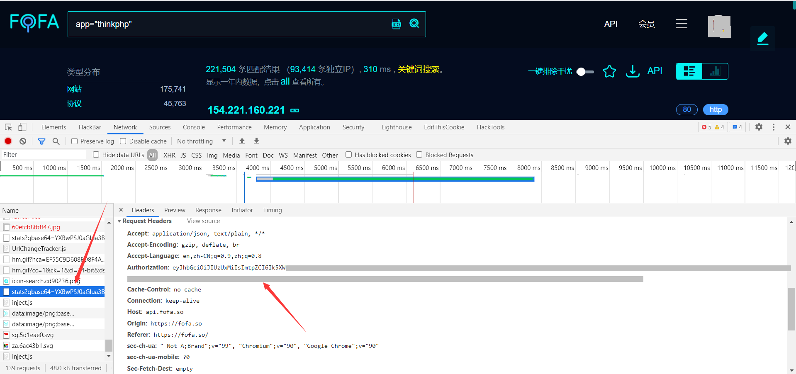
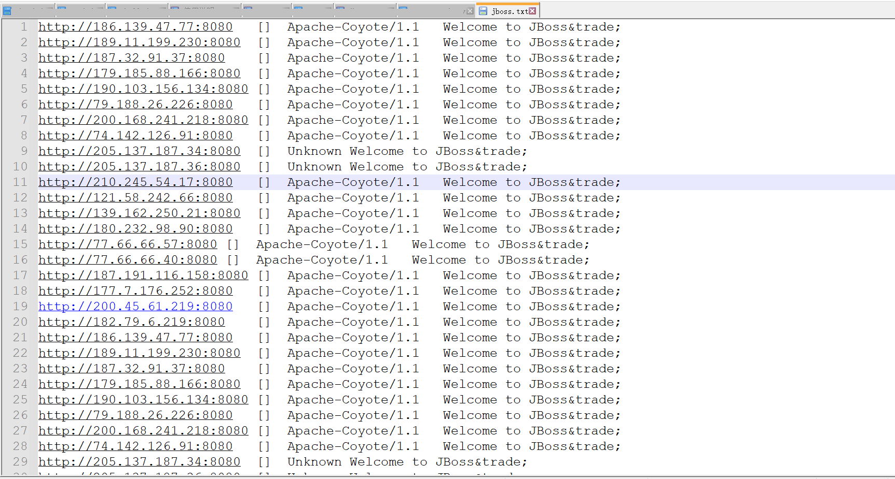

# FoFaSearch
- 基于爬虫式对FoFa数据进行爬取，需要请求头中的`Authorization`。

| 编号 | 参数     | 解释                                                      |
| :--: | -------- | --------------------------------------------------------- |
|  1   | auth     | 请求头中的Authorization参数，用于验证登录后的请求。(必要) |
|  2   | query    | 查询语句。(必要)                                          |
|  3   | start    | 从第几页开始。(必要)                                      |
|  4   | end      | 在第几页结束。(必要)                                      |
|  5   | number   | 选择爬取的数据类型，输出顺序也是这样。(必要)              |
|  6   | filepath | 文件保存路径，没有则只展示数据。(否)                      |

